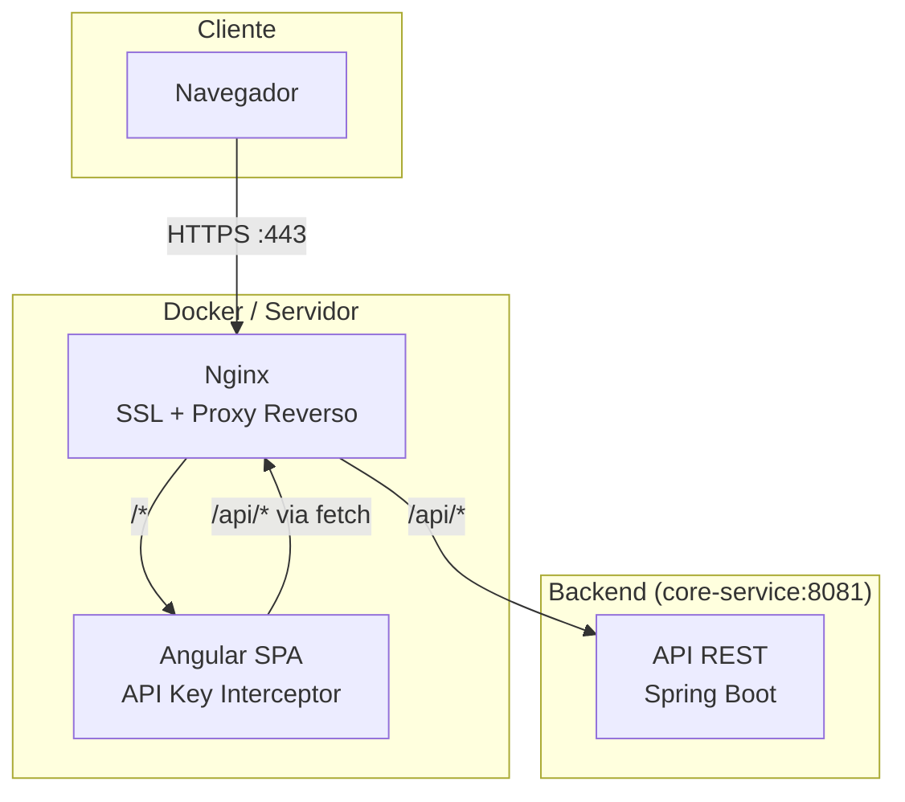
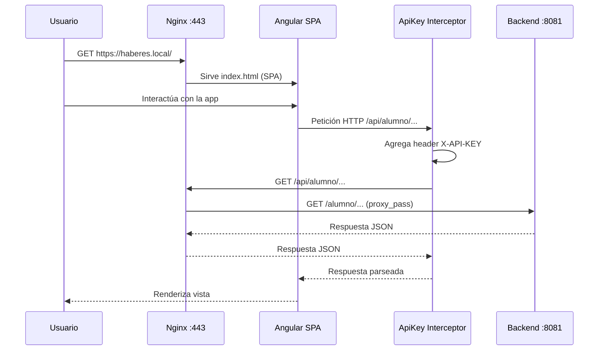

# SauceColegio v1.0.0

Frontend administrativo para la gestión escolar (alumnos, cursos, periodos, conceptos, facturación, recaudación y anotaciones).

## Arquitectura



### Flujo de Peticiones



## Despliegue con Docker

```bash
# Construir la imagen
docker build -t sauce-colegio-frontend .

# Ejecutar el contenedor
docker run -p 443:443 -p 80:80 sauce-colegio-frontend
```

La aplicación se sirve en `https://localhost` con un certificado SSL auto-firmado.

### Configuración del Backend

El Nginx actúa como proxy inverso: las rutas `/api/*` se redirigen al backend
`core-service:8081` (nombre del servicio en la red Docker). Asegúrate de que el
backend sea accesible con ese nombre de host.

## Development server

```bash
ng serve
```

Navega a `http://localhost:4200/`. La aplicación se recarga automáticamente al
modificar archivos fuente.

## Building

```bash
ng build
```

Los artefactos se generan en `dist/`. Para producción:

```bash
ng build --configuration production
```

## Running unit tests

```bash
ng test
```

Ejecuta las pruebas unitarias con [Vitest](https://vitest.dev/).

## API Configuration

La aplicación comunica con el backend a través de la ruta `/api` (proxy inverso
configurado en Nginx). Todas las peticiones HTTP incluyen automáticamente el
header `X-API-KEY` mediante un interceptor de Angular.

## Project Structure

```
src/
├── app/
│   ├── components/       # Componentes de la SPA
│   ├── interceptors/     # HTTP interceptors (API Key)
│   ├── models/           # Interfaces de datos
│   ├── services/         # Servicios HTTP
│   └── app.config.ts     # Configuración global
├── main.ts              # Punto de entrada
└── styles.scss          # Estilos globales
```

## Tecnologías

- **Angular 21.2** con signals y standalone components
- **Angular CDK** para componentes de UI
- **Vitest** para testing unitario
- **Nginx** para servir en producción
- **Docker** para contenedorización
