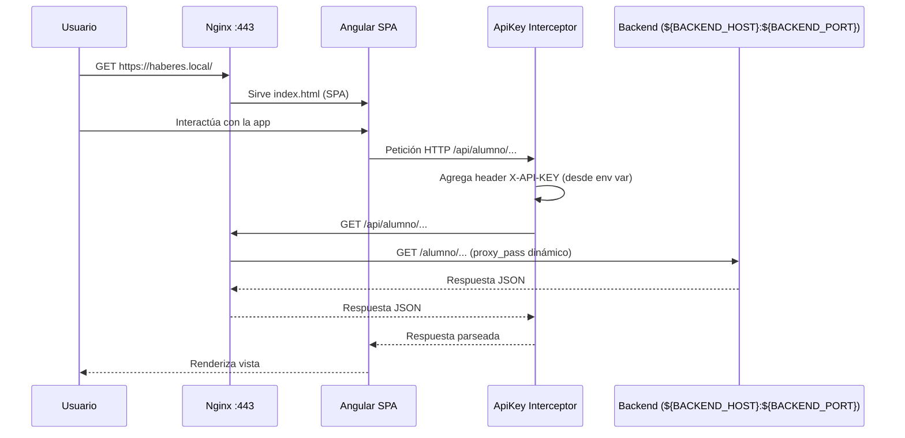

# SauceColegio v1.1.0

Frontend administrativo para la gestión escolar (alumnos, cursos, periodos, conceptos, facturación, recaudación y anotaciones).

## Arquitectura

```mermaid
graph TB
    subgraph "Cliente"
        Browser[Navegador]
    end

    subgraph "Docker / Servidor"
        direction TB
        EP[Entrypoint<br/>entrypoint.sh]
        Nginx[Nginx<br/>SSL + Proxy Reverso<br/>${BACKEND_HOST}:${BACKEND_PORT}]
        Angular[Angular SPA<br/>API Key Interceptor<br/>API_KEY_PLACEHOLDER]
    end

    subgraph "Backend (configurable via env vars)"
        API[API REST<br/>Spring Boot]
    end

    subgraph "Arranque del Contenedor"
        EP -->|envsubst| Nginx
        EP -->|sed| Angular
    end

    Browser -->|HTTPS :443| Nginx
    Nginx -->|/api/*| API
    Nginx -->|/*| Angular
    Angular -->|/api/* via fetch| Nginx
```

### Flujo de Peticiones



### Flujo de Arranque del Contenedor

```mermaid
sequenceDiagram
    participant D as Docker Daemon
    participant E as Entrypoint (entrypoint.sh)
    participant F as JS Compilados
    participant T as nginx.conf.template
    participant N as Nginx

    D->>E: docker run (API_KEY, BACKEND_HOST, BACKEND_PORT)
    E->>F: Busca API_KEY_PLACEHOLDER
    F-->>E: Archivo JS encontrado
    E->>F: sed: API_KEY_PLACEHOLDER → ${API_KEY}
    E->>T: envsubst: ${BACKEND_HOST}, ${BACKEND_PORT}
    T-->>E: default.conf generado
    E->>N: exec nginx -g "daemon off;"
    N-->>D: Nginx corriendo en :80 y :443
```

## Despliegue con Docker

```bash
# Construir la imagen
docker build -t sauce-colegio-frontend .

# Ejecutar el contenedor (con configuración dinámica)
docker run -p 443:443 -p 80:80 \
  -e BACKEND_HOST=core-service \
  -e BACKEND_PORT=8081 \
  -e API_KEY=mi-clave-secreta \
  sauce-colegio-frontend
```

La aplicación se sirve en `https://localhost` con un certificado SSL auto-firmado.

### Configuración del Backend

El Nginx actúa como proxy inverso: las rutas `/api/*` se redirigen al backend
configurado mediante las variables de entorno `BACKEND_HOST` y `BACKEND_PORT`
(valores por defecto: `core-service` y `8081`). Esto permite cambiar el backend
sin reconstruir la imagen Docker.

### Configuración en Tiempo de Ejecución

Al iniciar el contenedor, `entrypoint.sh` realiza dos tareas:

1. **Inyección de API Key:** Busca el marcador `API_KEY_PLACEHOLDER` en los
   archivos JS compilados y lo reemplaza con el valor de la variable `API_KEY`.
2. **Configuración de Nginx:** Procesa la plantilla `nginx.conf.template`
   sustituyendo `${BACKEND_HOST}` y `${BACKEND_PORT}` para generar la
   configuración final de Nginx.

Esto permite parametrizar el frontend sin necesidad de reconstruir la imagen
para cada entorno (desarrollo, staging, producción).

## Development server

```bash
ng serve
```

Navega a `http://localhost:4200/`. La aplicación se recarga automáticamente al
modificar archivos fuente.

## Building

```bash
ng build
```

Los artefactos se generan en `dist/`. Para producción:

```bash
ng build --configuration production
```

## Running unit tests

```bash
ng test
```

Ejecuta las pruebas unitarias con [Vitest](https://vitest.dev/).

## API Configuration

La aplicación comunica con el backend a través de la ruta `/api` (proxy inverso
configurado dinámicamente en Nginx). Todas las peticiones HTTP incluyen
automáticamente el header `X-API-KEY` mediante un interceptor de Angular.

En el código fuente, el valor de la API key es un placeholder
(`API_KEY_PLACEHOLDER`). Al desplegar con Docker, el script `entrypoint.sh`
reemplaza este marcador en los archivos JS compilados usando la variable de
entorno `API_KEY`, evitando almacenar secretos en el repositorio.

## Project Structure

```
src/
├── app/
│   ├── components/       # Componentes de la SPA
│   ├── interceptors/     # HTTP interceptors (API Key)
│   ├── models/           # Interfaces de datos
│   ├── services/         # Servicios HTTP
│   └── app.config.ts     # Configuración global
├── main.ts              # Punto de entrada
└── styles.scss          # Estilos globales

Docker/
├── Dockerfile           # Build multi-etapa (Node 22 → Nginx)
├── entrypoint.sh        # Script de entrada con inyección runtime
└── nginx.conf.template  # Plantilla Nginx con variables de entorno
```

## Tecnologías

- **Angular 21.2** con signals y standalone components
- **Vitest** para testing unitario
- **Nginx** para servir en producción
- **Docker** para contenedorización
